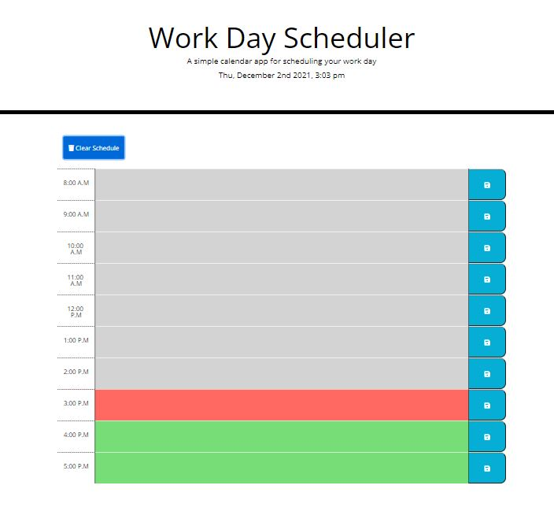

# Work Day Scheduler

## Description

A simple calender application was created using JQuery, Javascript, html, and CSS.The calender displays color coded time blocks that notifies the user whether an event is in the past, present, or future. You will be allowed to enter your events in each time block and click the save button to save your event in local storage.You can also clear your schedule by clicking the clear button and it will remove your events from local storage and the text in the time blocks. The calender also displays a date at the top in which is updated automatically every new date.

[Website Link](https://trrgomez.github.io/Work-Day-Scheduler/)
